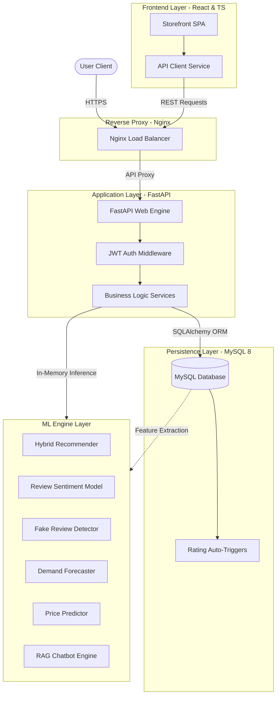
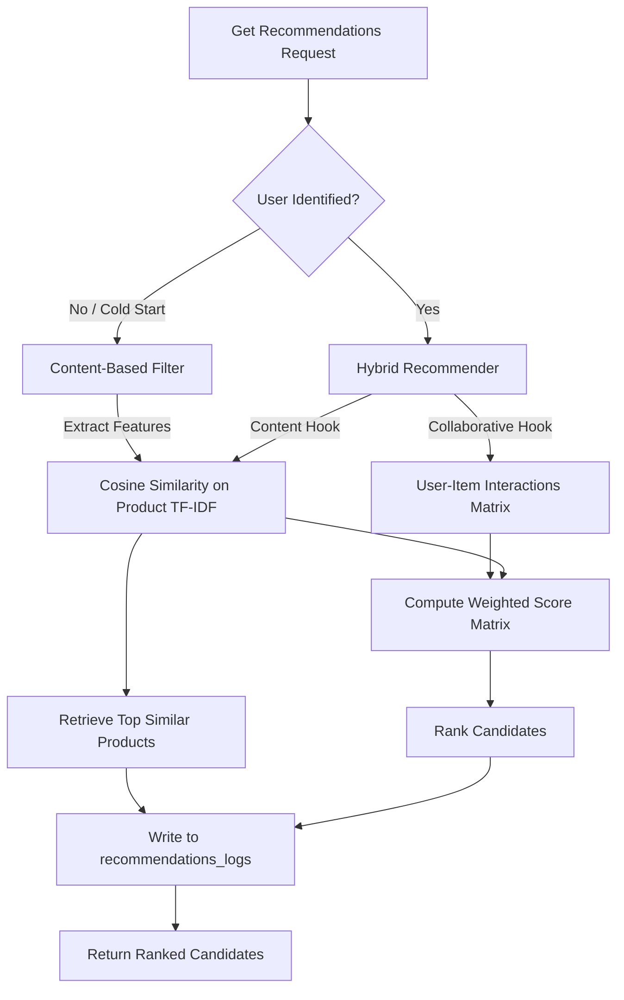
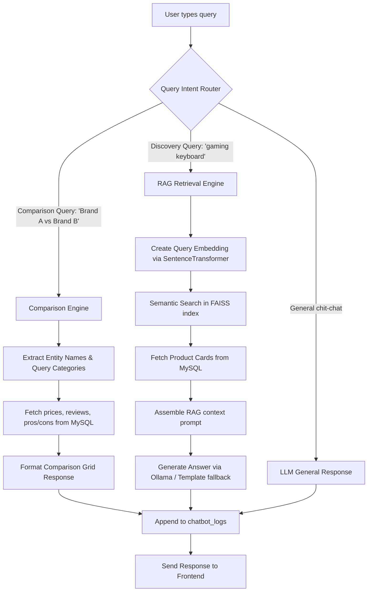

# System Architecture Documentation

This document describes the architectural layout, machine learning components, recommendation pipelines, and conversational data flows of the Aura-Commerce-AI (Xecomerce) platform.

---

## 1. System Architecture Overview

Aura-Commerce-AI is designed as an N-tier distributed application combining transactional e-commerce workflows with analytical intelligence pipelines.

---

## 2. Machine Learning Architecture

The Machine Learning layer is divided into discrete service modules located in the `ml_models/` package. Model training is executed offline via the automated training orchestrator, outputting serialized joblib weights to `saved_models/` which are loaded into RAM by the FastAPI application during worker startup.

### Models and Frameworks
- **Sentence Transformers & FAISS:** Used for semantic keyword search, voice query matching, and image vector similarity search.
- **Scikit-Learn (Logistic Regression & RF):** Powers review sentiment scoring, fake review classification, demand forecasting, and pricing models.
- **Ollama / Templates:** Powers the RAG chatbot and product comparison engines.

---

## 3. Recommendation Pipeline

The recommendation engine implements a **Hybrid Recommendation Strategy** combining Content-Based Filtering with Collaborative Filtering hooks to mitigate the cold-start problem and deliver personalized lists.

---

## 4. Chatbot Pipeline

The conversational shopper assistant contains a RAG (Retrieval-Augmented Generation) pipeline that routes user queries depending on their intent.

---

## 5. End-to-End Data Flow

### 1. Product Review Lifecycle & Automated Moderation
1. **Submit:** The user submits a review text and rating through the storefront UI.
2. **REST API:** The UI fires a `POST /api/reviews` request.
3. **ML Check (Fake Review):** The `review_service.py` intercepts the request and sends the text to the `FakeReviewModel` (Logistic Regression).
4. **ML Check (Sentiment):** The text is passed to the `SentimentModel` (TF-IDF vectorizer + Logistic Regression) to compute sentiment labels (Positive, Neutral, Negative).
5. **Database Commit:** The review record is saved in MySQL with flags: `is_fake`, `fake_probability`, and `sentiment`.
6. **Trigger Recalculation:** The MySQL trigger `after_review_insert` fires automatically. It updates the product's aggregated ratings in the `ratings` table and syncs the average score to the main `products` table.
7. **Response:** The frontend receives the created review object, immediately reflecting updated star averages.
