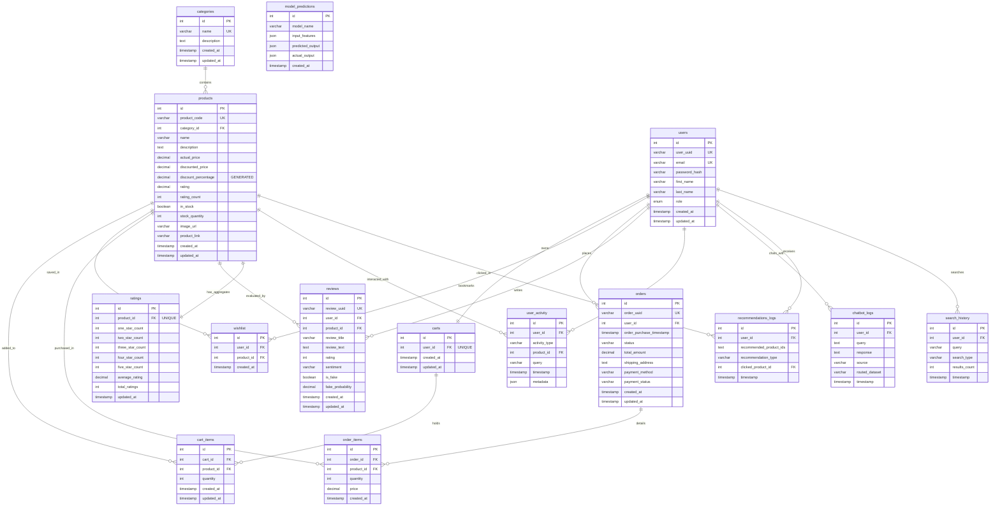

# Entity Relationship Diagram (ERD) Documentation

This document describes the relational model of the Aura-Commerce-AI (Xecomerce) platform, representing 15 highly normalized tables. The database captures core e-commerce transactions, user activities, and logs generated by NLP and machine learning pipelines.

---

## 1. Entity Descriptions

### Core E-Commerce Entities
- **`categories`**: Stores product taxonomies (e.g., Computers, Electronics) to support tiered browsing.
- **`products`**: Contains product catalogs, pricing attributes, cached customer ratings, and stock inventory.
- **`users`**: Contains credential hashes and authorization roles (`admin`, `seller`, `customer`) for accounts.
- **`carts` & `cart_items`**: Manages volatile shopping cart selections mapped to individual users.
- **`wishlist`**: Stores product selections saved by customers.
- **`orders` & `order_items`**: Retains permanent historical records of user transactions and item-level details (quantities, prices paid).
- **`reviews`**: Retains user text feedback, ratings (1 to 5), predicted sentiments, and fraud tags.
- **`ratings`**: Caches rating distributions (1-star through 5-star counts) and averages per product, updated automatically via database triggers.

### AI and Analytics Logs
- **`user_activity`**: Captures user clicks, product views, and searches to serve as direct inputs for the hybrid recommendation engine.
- **`chatbot_logs`**: Logs query-response pairings for conversational analytics and dataset routing auditing.
- **`recommendations_logs`**: Logs candidate recommendations shown to users and records click-through actions.
- **`model_predictions`**: Logs feature inputs, prediction outputs, and actual outcomes of ML models to facilitate monitoring and data drift checks.
- **`search_history`**: Tracks text, voice, and image-based queries and result counts.

---

## 2. Mermaid Entity Relationship Diagram

The following diagram illustrates the primary keys (PK), foreign keys (FK), check constraints, and relationships.

---

## 3. Database Triggers and Constraints

1. **Check Constraints**:
   - `chk_actual_price` & `chk_discounted_price`: Prevents negative pricing.
   - `chk_price_relation`: Ensures `discounted_price` is less than or equal to `actual_price`.
   - `chk_cart_item_quantity` & `chk_order_item_quantity`: Restricts quantities to > 0.
   - `chk_review_rating`: Validates that customer reviews fall in the range of 1 to 5.
2. **Trigger Recalculations**:
   - When a review is **inserted**, the `after_review_insert` trigger automatically updates the star count and recalculates the average rating inside `ratings`, syncing it back to `products.rating` and `products.rating_count`.
   - On review **updates** (e.g., a customer changes their rating), `after_review_update` adjusts the star counts and average.
   - On review **deletion**, `after_review_delete` decrements counts and updates the average.
