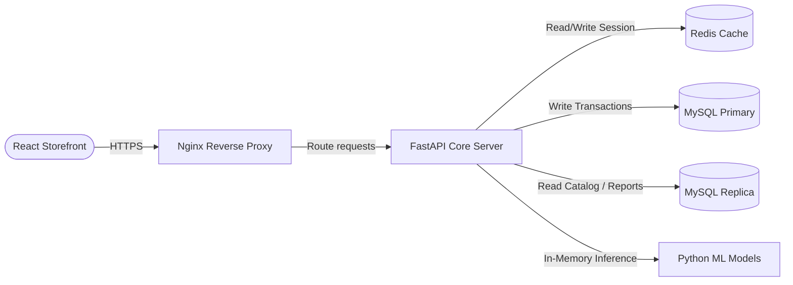
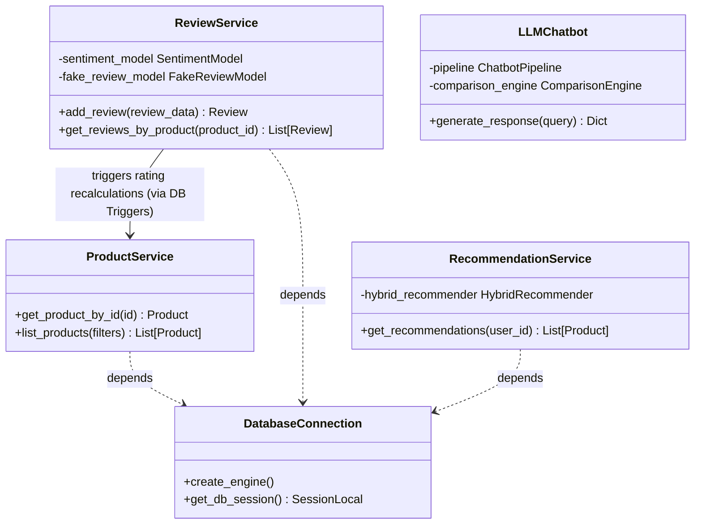

# System Design Documentation

This document outlines the High-Level Design (HLD), Low-Level Design (LLD), scalability, security, and performance characteristics of the Aura-Commerce-AI (Xecomerce) platform.

---

## 1. High-Level Design (HLD)

The system consists of modular subsystems that communicate via REST APIs, database queries, and direct in-memory Python calls.

### Component Breakdown
1. **React Storefront Client:** Single Page Application rendering search, chatbot panels, checkout workflows, and analytics widgets.
2. **Nginx Reverse Proxy:** Throttles incoming connections, manages CORS configurations, terminates SSL, and distributes load across FastAPI uvicorn processes.
3. **FastAPI Web Service:** Executes application logic. Spawns asynchronous worker pools, enforces rate limiters, verifies tokens, and integrates business services with models.
4. **Database Subsystem (MySQL 8):** Normalized tables with native triggers for aggregations, ensuring referential integrity and optimized transactional state retention.
5. **Machine Learning Inference Subsystem:** Persisted model files loaded in-memory to provide near real-time predictions.

---

## 2. Low-Level Design (LLD)

Below is the class relationship diagram mapping the service layer and database entities in the backend code structure.

---

## 3. Scalability

To support millions of active shoppers, Aura-Commerce-AI uses several architectural scaling patterns:

1. **Horizontal Backend Scaling:** FastAPI is stateless. Multiple Uvicorn instances are run behind Nginx, allowing automatic scale-out inside Docker Compose or Kubernetes clusters.
2. **Database Read/Write Separation:**
   - **Primary Write Node:** Receives heavy transactional traffic (placing orders, adding items to cart, posting reviews).
   - **Read Replicas:** Serves catalog browsing, search lookups, and historical reporting pages.
3. **Multi-tier Caching (Redis):**
   - **Session Caching:** Retains user cart states and tokens to bypass database checks.
   - **Catalog Caching:** Stores highly accessed categories and products lists, invalidated only on seller updates.
4. **Offline Model Training:** Model training is decoupled from the web application. Model weights are trained asynchronously on dedicated compute nodes and loaded as static binaries during backend deployment.

---

## 4. Security

1. **Authentication & Authorization:**
   - **JWT Tokens:** Authenticates stateless HTTP requests via secure JSON Web Tokens.
   - **Role-Based Access Control (RBAC):** Restricts admin routes and analytical metrics to users tagged with the `admin` role, and catalog management routes to the `seller` role.
2. **Data Sanitization & Injection Prevention:**
   - **SQLAlchemy ORM:** Utilizes parameterized queries automatically to prevent SQL Injection attacks.
   - **Input Sanitization:** Cleans string payloads using Pydantic validation frameworks to mitigate Cross-Site Scripting (XSS).
3. **Database Isolation & Safety Constraints:**
   - **Foreign Keys:** Prevents orphaned records (e.g. deleting an order cascade deletes order items, but deleting a user with active orders is restricted).
   - **Triggers:** Recalculates product rating aggregates inside a closed database transaction block, removing potential race conditions.

---

## 5. Performance Engineering

1. **Database Indexing:**
   - Indexes on search patterns (`idx_search_query`), UUID checks (`idx_order_uuid`), and foreign keys (`idx_review_product`, `idx_order_user`) prevent table scans.
2. **Denormalized Aggregation Cache:**
   - Storing `rating` and `rating_count` on the `products` table avoids calculating averages across millions of reviews on every catalog load request. The values are synced via triggers during writes.
3. **In-Memory ML Inference:**
   - TF-IDF vectorizers and classifiers are loaded directly into application memory using `joblib`. This eliminates HTTP request delays to external ML model services.
